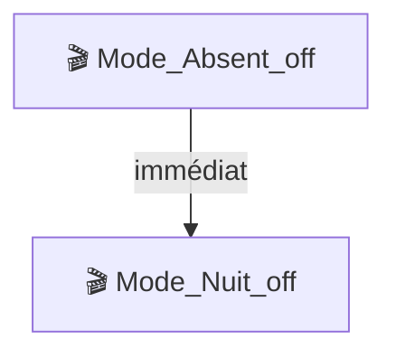

# Référence des cas d'usage

Cette page décrit les 13 workflows de la skill avec des exemples de phrases déclencheuses et le format de sortie attendu.

---

## Familles de workflows

| Famille | Workflows | Description |
|---|---|---|
| Santé | WF1 | Audit général de l'installation |
| Diagnostic | WF2, WF3, WF4, WF13 | Pourquoi X ne fonctionne plus ? |
| Compréhension | WF5, WF12 | Que fait X ? Comment X est-il connecté ? |
| Analyse | WF6, WF7 | Qui dépend de X ? Comment améliorer X ? |
| Lecture rapide | WF8, WF9, WF10, WF11 | Valeur, historique, variable, recherche |

---

## WF1 — Audit général

**Phrases déclencheuses :**
> "Fais un audit de mon Jeedom", "Santé de mon install", "Qu'est-ce qui cloche ?", "Diagnostic complet"

**Ce que la skill fait :**
Collecte l'inventaire complet (eqLogics, scénarios, plugins, commandes), applique les seuils de santé (✅/⚠️/❌), et produit un rapport en 12 sections fixes.

**Format de sortie :**

```
## Audit général — [Date]

### Inventaire
[Tableau : équipements, scénarios, plugins, commandes]

### Points d'attention
⚠️ X commandes info historisées sans valeur
⚠️ Y équipements désactivés depuis > 30 jours

### [10 autres sections selon ce qui est trouvé]
```

---

## WF2 — Diagnostic scénario

**Phrases déclencheuses :**
> "Pourquoi le scénario X ne se déclenche plus ?", "X est cassé", "X ne marche plus depuis hier"

**Ce que la skill fait :**
Inspecte l'état du scénario, ses déclencheurs, les valeurs des commandes déclencheuses, et lit les logs récents.

**Format de sortie :**

```
### Diagnostic — [Nom du scénario]

**État courant** : actif / inactif / mode schedule
**Triggers** : [commandes + valeurs actuelles]
**Dernières exécutions** : [logs récents]
**Pistes** : probable / possible / improbable
**Prochaine étape** : [vérification UI recommandée]
```

> Mode API-only : les logs sont indisponibles. Seuls l'état et les triggers sont vérifiables.

---

## WF3 — Diagnostic équipement

**Phrases déclencheuses :**
> "[Équipement] est mort", "Ce capteur ne remonte plus", "[X] ne répond plus"

**Ce que la skill fait :**
Vérifie l'état de l'équipement, l'état du daemon de son plugin, la dernière valeur connue, et les logs du plugin.

---

## WF4 — Diagnostic plugin

**Phrases déclencheuses :**
> "jMQTT déconne", "Le daemon ne démarre pas", "[Plugin] a un problème"

**Ce que la skill fait :**
Identifie le plugin, vérifie son état et son daemon, inspecte les eqLogics en warning/danger, lit les logs du plugin.

---

## WF5 — Explication scénario

**Phrases déclencheuses :**
> "Explique-moi le scénario X", "Que fait cette automatisation ?", "Comment fonctionne X ?"

**Ce que la skill fait :**
Lit le scénario, résout toutes les références `#ID#` en `#[Objet][Équipement][Commande]#`, et produit un pseudo-code lisible.

**Format de sortie :**

```
### Scénario — [Nom] (id: N)

**Déclencheurs :** [liste]
**Mode :** [provoke / schedule / ...]

**Logique :**
SI #[Présence][Géraud Shelly][Présence]# == 1 ALORS
  → Action : [Chauffage][Bureau][On]
  → Scénario : Mode_Présence_on
SINON
  → Attendre 5 min
  → ...
```

**Note :** les appels à d'autres scénarios sont mentionnés par nom. Pour les dérouler, demandez explicitement :
> "Déroule aussi le scénario Mode_Présence_on"

---

## WF6 — Graphe d'usage

**Phrases déclencheuses :**
> "Qu'est-ce qui dépend de [commande X] ?", "Qui utilise [équipement Y] ?", "Qu'est-ce qui appelle le scénario Z ?"

**Ce que la skill fait :**
Identifie toutes les références à la cible (commande, équipement ou scénario) dans les triggers, conditions, actions et code des scénarios.

**Format de sortie :**

```
### Graphe d'usage — [Cible]

**Utilisée comme déclencheur dans :** [tableau]
**Utilisée dans des conditions :** [tableau]
**Utilisée dans des actions :** [tableau]
**Total : N références dans M scénarios**
```

---

## WF7 — Suggestions de refactor

**Phrases déclencheuses :**
> "Comment simplifier le scénario X ?", "Nettoie mes scénarios", "Améliore X"

**Ce que la skill fait :**
Analyse le scénario selon une grille d'anti-patterns (conditions dupliquées, variables orphelines, délais en dur, etc.) et produit des suggestions hiérarchisées par impact.

**Format de sortie par suggestion :**

```
### Suggestion 1 — [Titre court]
**Constat :** ...
**Impact :** ...
**Pas-à-pas UI :** (étapes numérotées dans l'interface Jeedom)
**Vérification :** ...
```

> La skill ne fait jamais le refactor — elle le décrit et vous guide dans l'interface.

---

## WF8 — Valeur courante

**Phrases déclencheuses :**
> "Quelle est la température du salon ?", "Valeur actuelle de [commande X]"

**Format de sortie :**
```
#[Salon][Température][Valeur]# = 21.3 °C, mis à jour il y a 2 min
```

---

## WF9 — Historique

**Phrases déclencheuses :**
> "Historique de la température salon sur 24h", "Évolution de [commande X]"

**Format de sortie :** tableau si < 50 lignes, résumé statistique sinon.

---

## WF10 — Variable dataStore

**Phrases déclencheuses :**
> "Valeur de la variable ModeAlerte", "Que vaut le dataStore [X] ?"

**Format de sortie :**
```
Variable ModeAlerte = "1" (globale, dernière mise à jour : il y a 3h)
```

---

## WF11 — Recherche

**Phrases déclencheuses :**
> "Liste tous mes équipements Virtual", "Trouve les scénarios en mode schedule", "Quels plugins sont installés ?"

**Format de sortie :** tableau filtré par les critères verbalisés.

---

## WF12 — Cartographie d'orchestration

**Phrases déclencheuses :**
> "Trace la chaîne complète depuis [scénario X]", "Qui appelle qui ?", "Flux complet quand [événement]"

**Ce que la skill fait :**
Parcourt récursivement les appels inter-scénarios avec détection de cycles.

**Format de sortie :**

- ≤ 10 nœuds → prose indentée
- > 10 nœuds → diagramme mermaid `graph TD`



---

## WF13 — Forensique causale

**Phrases déclencheuses :**
> "Ce scénario fait X au lieu de Y — remonte la chaîne", "Trouve d'où vient le bug"

**Ce que la skill fait :**
Enquête data-driven et interactive : remonte les déclencheurs, lit les logs sur une fenêtre temporelle, identifie la cause racine.

**Particularité :** workflow interactif — Claude peut demander des précisions à chaque étape. Maximum 5 niveaux de remontée.

> Indisponible en mode API-only (logs requis).

---

## Modes d'accès

| Workflow | SSH+MySQL | API seule |
|---|---|---|
| WF1 (audit général) | Complet | Partiel (pas de logs) |
| WF2 (diagnostic scénario) | Complet | Partiel (pas de logs) |
| WF3 (diagnostic équipement) | Complet | Partiel |
| WF4 (diagnostic plugin) | Complet | Oui |
| WF5 (explication scénario) | Complet | Oui |
| WF6 (graphe d'usage) | Complet | Partiel |
| WF7-11 | Complet | Oui (sauf logs) |
| WF12 (orchestration) | Complet | Oui |
| WF13 (forensique) | Complet | Non — logs requis |
