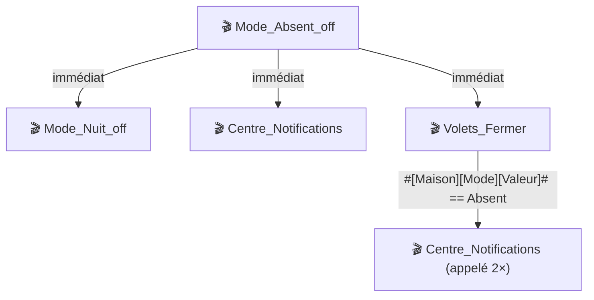

# Cas d'acceptation 05 — Cartographie d'orchestration (WF12)

## Prompt utilisateur

> "Trace-moi la chaîne complète d'appels à partir du scénario Mode_Absent_off"

## Prérequis

- Accès SSH+MySQL configuré
- `scenario_tree_walker.py` avec `follow_scenario_calls` opérationnel
- Scénario "Mode_Absent_off" (ou équivalent) appelant d'autres scénarios

## Ce que la skill doit faire

1. Identifier le scénario par son nom
2. Exécuter `scenario_tree_walker.py` avec `follow_scenario_calls=3`, `max_depth=3`
3. Compter les nœuds : >10 → mermaid, ≤10 → prose indentée
4. Résoudre les `#ID#` via `resolve_cmd_refs.py`
5. Produire le diagramme annoté avec les conditions de chaque appel

## Format de sortie attendu (>10 nœuds → mermaid)

````markdown
### Cartographie — Mode_Absent_off (sc13) — profondeur max 3



**Point d'entrée :** sc13 — 4 scénarios dans la chaîne, 0 cycle détecté
**Limites :** profondeur max 3, chaînes tronquées marquées "…"
````

## Critères de validation

- [ ] La règle nœuds >10 → mermaid est respectée
- [ ] Le diagramme mermaid est syntaxiquement valide
- [ ] Les cycles inter-scénarios sont détectés et signalés (pas de boucle infinie)
- [ ] Les scénarios appelés introuvables génèrent un warning, pas une erreur fatale
- [ ] Les arêtes conditionnelles sont labellisées

## Résultats

| Date | Environnement | Résultat | Notes |
|---|---|---|---|
| 2026-04-28 | Box réelle Jeedom 4.5.3 — SSH+MySQL | ✅ PASS | sc13 → sc10, sc8, sc14, sc20 — 4 nœuds, 0 cycle, mermaid valide |
