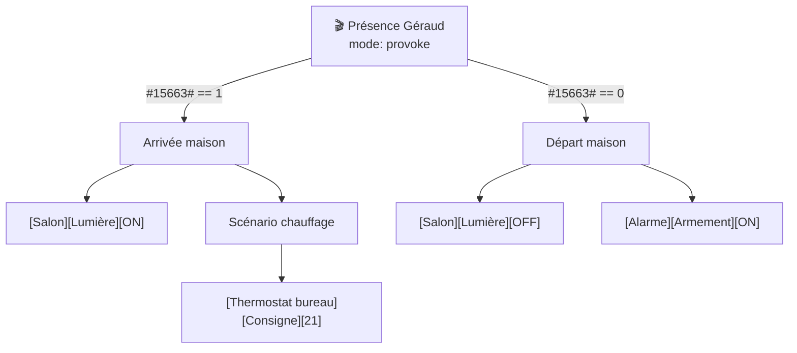

# Templates de rapport WF1 — Audit général

> **Usage :** ce fichier est chargé par WF1 pour structurer la réponse.  
> Les sections vides sont omises. L'ordre est fixe.  
> Les données viennent du batch `AUDIT_QUERIES` défini dans `sql-cookbook.md §10`.

---

## Structure du rapport (12 sections)

```
§1  Synthèse exécutive          ← toujours présente
§2  Système                     ← version, nom install
§3  Plugins                     ← liste + état
§4  Équipements                 ← comptage, désactivés, warnings
§5  Scénarios                   ← actifs, inactifs, modes
§6  Commandes mortes            ← présentes si > 0
§7  Variables dataStore         ← toujours présente
§8  Messages système            ← présente si erreurs récentes
§9  Mises à jour disponibles    ← présente si status != 'ok'
§10 Qualité de l'historique     ← présente si anomalies
§11 Observations                ← anti-patterns notables
§12 Actions recommandées        ← prioritisées par impact
```

---

## §1 — Synthèse exécutive

```
Jeedom [version] — [nom_install]
[N] équipements actifs / [N] scénarios actifs
[état_global] : [1-2 phrases résumant les points chauds]
```

**État global :** choisir parmi :
- `✅ Installation saine` — aucune anomalie critique
- `⚠️ Quelques points à surveiller` — anomalies mineures
- `❌ Problèmes détectés` — commandes mortes, erreurs répétées, plugins défaillants

---

## §2 — Système

| Clé | Valeur |
|-----|--------|
| Version Jeedom | `[value]` |
| Nom installation | `[value]` |
| Dernière vérification updates | `[value]` |

---

## §3 — Plugins installés

Tableau des plugins actifs :

| Plugin | Version | État |
|--------|---------|------|
| `jMQTT` | 4.5.x | ✅ ok |
| `virtual` | 4.5.x | ✅ ok |
| `agenda` | 4.5.x | ✅ ok |

> Plugins désactivés non listés sauf si anomalie.  
> État : `✅ ok` / `⚠️ update disponible` / `❌ erreur`

---

## §4 — Équipements

```
Total : [N]  —  Actifs : [N]  —  Désactivés : [N]
```

Si équipements en warning/danger :
```
⚠️ Équipements avec alertes :
  - "Nom équipement" (plugin) — [warning: message]
```

Si équipements désactivés mais référencés en scénario :
```
⚠️ Équipements désactivés mais référencés en scénario :
  - "Nom équipement" — utilisé dans "Nom scénario"
```

---

## §5 — Scénarios

```
Total : [N]  —  Actifs : [N]  —  Inactifs : [N]
  Provoke : [N]  —  Schedule : [N]  —  Always : [N]
```

Si scénarios désactivés appelés en action depuis d'autres scénarios :
```
⚠️ Scénarios inactifs référencés :
  - "Absence Geraud" — appelé par "Présence Géraud"
```

---

## §6 — Commandes mortes

> Section omise si 0 commande morte.

```
[N] commandes sans équipement actif :
  - cmd_id [XXXX] "Nom commande" (eqLogic_id: YYYY)
    → Équipement associé : désactivé / supprimé
```

Action recommandée : vérifier si ces commandes sont encore référencées en scénario avant suppression.

---

## §7 — Variables dataStore

```
[N] variables globales :
  - NomVar1 = "valeur1"
  - NomVar2 = "valeur2"
  ...
```

Si variables orphelines détectées :
```
⚠️ Variables globales non référencées dans aucun scénario :
  - "VarOrpheline" = "valeur"
```

---

## §8 — Messages système récents

> Section omise si aucun message d'erreur récent.

```
Erreurs récentes ([N]) :
  [date] [plugin] : [message]
  [date] [plugin] : [message]
```

> Limité aux 20 dernières erreurs.

---

## §9 — Mises à jour disponibles

> Section omise si tous les plugins sont à jour.

```
[N] mise(s) à jour disponible(s) :
  - PluginA v1.2 → mise à jour disponible
  - PluginB v3.1 → mise à jour disponible
```

---

## §10 — Qualité de l'historique

> Section omise si aucune anomalie.

```
Commandes historisées sans données récentes (>7 jours) : [N]
  - "Nom commande" (équipement) — dernière valeur : [date] ou jamais
```

---

## §11 — Observations

> Section omise si aucun anti-pattern notable.

Anti-patterns courants à signaler :

| Anti-pattern | Condition de signalement |
|---|---|
| Commandes sans Type Générique | > 10 commandes info sans generic_type |
| Scénarios désactivés anciens | inactifs depuis > 3 mois (via lastLaunch API) |
| Variables orphelines | non référencées dans aucune expression |
| Messages d'erreur répétitifs | même plugin > 5 fois dans messages récents |
| Plugins version ancienne | version < version actuelle stable |

---

## §12 — Actions recommandées

Priorisées par impact/effort :

```
🔴 Urgent :
  1. [Action urgente avec impact critique]

🟡 À faire prochainement :
  2. [Action modérée]
  3. [Action modérée]

🟢 Nettoyage optionnel :
  4. [Action de confort]
```

**Chaque action :** Constat → Impact → Pas-à-pas UI (jamais de SQL ou script modificateur).

---

## Format de la synthèse finale

```markdown
## Audit Jeedom [version] — [date]

**[état_global]** — [phrase résumé]

| Indicateur | Valeur |
|---|---|
| Équipements actifs | [N] / [total] |
| Scénarios actifs | [N] / [total] |
| Commandes mortes | [N] |
| Erreurs système | [N] |
| Mises à jour | [N] disponibles |

[sections §2 à §12 selon pertinence]
```

---

## Template WF7 — Suggestions de refactor

> **Usage :** ce template structure la réponse pour WF7.  
> Déclencheurs : "comment simplifier", "améliorer", "nettoyer", "factoriser".  
> Toujours lecture seule — pas de SQL modificateur, pas de script généré.

### En-tête

```
## Suggestions de refactor — [Nom ou périmètre cible]

> Analyse basée sur : [audit WF1 / diagnostic WF2 / explication WF5 / etc.]  
> [N] suggestion(s) identifiée(s), classées par impact décroissant.
```

### Structure d'une suggestion

```
### Suggestion [N] — [Titre court]

**Constat :** [Ce qui est observé — fait factuel, sans jugement.]

**Impact :** [Pourquoi c'est un problème — maintenabilité, fiabilité, performance, lisibilité.]

**Pas-à-pas UI :**
1. Aller dans Outils → Scénarios → [nom du scénario]
2. [étapes UI précises]
3. Sauvegarder

**Vérification :** [Comment confirmer que le changement a eu l'effet voulu — log attendu, valeur de commande, comportement observable.]
```

### Anti-patterns à détecter (ordre de priorité)

| Anti-pattern | Signal SQL / structurel |
|---|---|
| Conditions dupliquées | Même expression dans plusieurs blocs IF du même scénario |
| Délais en dur | `action=wait` avec valeur fixe non paramétrable |
| `triggerId()` déprécié | Expression contenant `triggerId()` |
| Commande sans Type Générique | `cmd.generic_type IS NULL` ou vide |
| Scénario désactivé référencé | Appel vers scénario avec `isActive=0` |
| Variable globale orpheline | `dataStore` jamais lue dans aucun scénario |
| Scénario en mode "provoke" sans trigger | `mode='provoke'` et `trigger='[]'` |

---

## Template WF12 — Cartographie d'orchestration

> **Usage :** ce template structure la réponse pour WF12.  
> Déclencheurs : "trace la chaîne d'appels", "montre le flux complet quand X", "qui appelle qui".  
> Sortie adaptative : prose si ≤10 nœuds, mermaid `graph TD` si >10 nœuds.

### En-tête commun

```
## Cartographie d'orchestration — [Point d'entrée]

> Point d'entrée : [scénario "Nom" (ID N) / commande [O][E][C] / événement]  
> Profondeur explorée : [N] niveau(x) — [N] scénario(s) au total
```

### Sortie prose (≤10 nœuds)

```
**[Scénario racine "Nom" — ID N]**  
Mode : [provoke/scheduled/etc.] | Déclencheur : [trigger]

  → SI [condition] :
      → Action : [commande ou appel]
      → Appelle **"Scénario enfant A" (ID M)**
          → SI [condition enfant] :
              → Action : [commande]
          → Appelle **"Scénario petit-enfant B" (ID P)**
              [tronqué — profondeur max atteinte]

  → SINON :
      → Action : [commande]
```

### Sortie mermaid (>10 nœuds)

````

````

**Convention nœuds mermaid :**

| Type | Format label | Icône |
|---|---|---|
| Scénario | `SN["🎬 Nom\nmode: X"]` | 🎬 |
| Commande action | `CN["[O][E][C]"]` | aucune |
| Point d'entrée externe (trigger cmd) | `TN["⚡ [O][E][C]"]` | ⚡ |
| Nœud tronqué | `XN["… (tronqué)"]` | … |

**Arêtes :** libellé = condition SI présente, absent si action inconditionnelle.

### Pied de page commun

```
> **Limite :** profondeur max [N] — appels au-delà non explorés.  
> **Cycles détectés :** [aucun / liste des boucles ignorées].  
> Pour explorer un sous-arbre spécifique, demandez : "détaille le scénario X".
```
